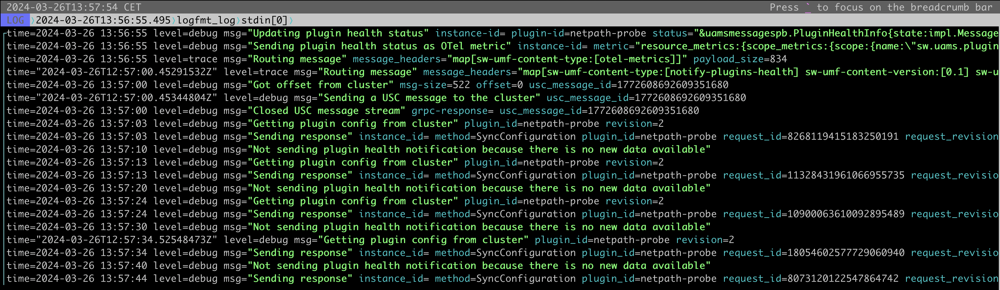

# papertrail-cli-poc

# Run
1. [Install Go](https://go.dev/doc/install)
2. Clone the repository
```
git clone https://github.com/jskiba/papertrail-cli-poc.git
```
3. Build
```
cd papertrail-cli-poc
go build .
```
4. Run
```
env PAPERTRAIL_TOKEN=<your-token> ./papertrail-cli-poc <number-of-lines>
```

for better readability:
```
brew install lnav
env PAPERTRAIL_TOKEN=<your-token> ./papertrail-cli-poc <lines-of-logs> | lnav
```

Example output:
```
jakub.skiba@MBKC9NKCG7QM papertrail-cli % env PAPERTRAIL_TOKEN=hGvlkV8598hH6r3mQOdj ./papertrail-cli 5
time="2024-03-26T12:56:03.499714715Z" level=debug msg="Getting plugin config from cluster" plugin_id=netpath-probe revision=2
time="2024-03-26T12:56:03.509071704Z" level=debug msg="Sending response" instance_id= method=SyncConfiguration plugin_id=netpath-probe request_id=16543187535338838385 request_revision=2 response_newest_revision=2 total-records-to-send=0
time="2024-03-26T12:56:10.453805475Z" level=debug msg="Not sending plugin health notification because there is no new data available"
time="2024-03-26T12:56:13.512349919Z" level=debug msg="Getting plugin config from cluster" plugin_id=netpath-probe revision=2
time="2024-03-26T12:56:13.520542234Z" level=debug msg="Sending response" instance_id= method=SyncConfiguration plugin_id=netpath-probe request_id=12711613475161430896 request_revision=2 response_newest_revision=2 total-records-to-send=0
```

```
jakub.skiba@MBKC9NKCG7QM papertrail-cli % env PAPERTRAIL_TOKEN=hGvlkV8598hH6r3mQOdj ./papertrail-cli 20 | lnav
```
